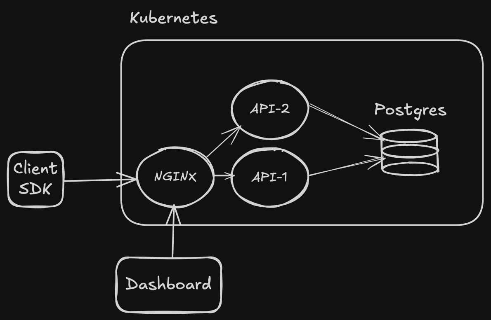
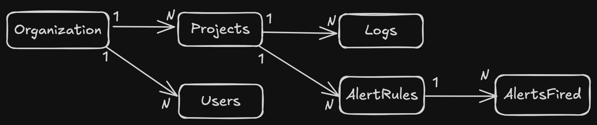

# Error Loggin Service Architecture

## Customer Questions

I have previous knowledge from the requirements document and I'm supposing that this service is similar to Sentry, DataDog, etc.

### What kind of services would you like to support? Frontend, backend, mobile, which languages?

Customer> I'd like to support both frontend and backend in the NodeJS ecosystem as an MVP but I'm willing to expand to other languages and environments.

### Do you know other services that is comparable to this one and that you would like to take inspiration from?

Customer> I know Sentry is a very popular service and I like their interface and ease of use.

### Who are your intended users?

Customer> I want this service to be used by developers of any sized company, globally.

### What is your expected time frame for this project?

Customer> I'm looking to release this MVP in the next 6 months.

Based on the the questionaire, I'm going to propose a reduced architecture that will be used for the MVP.

## Architecture Overview

### Tech Stack

- TypeScript: Type safety for JavaScript
- NestJS: Leading backend framework for NodeJS, a lot of pre-built components and well-thought patterns.
- NextJS: Leading frontend framework, powerful, flexible and industry standard.
- PostgreSQL: A powerful, flexible, open source, relational database. Gives us a room for improvements and has a lot of features.
- Kubernetes: Industry standard container orchestration platform. Awesome for deploying and scaling.
- Docker: For building and deploying containers.
- AWS: For cloud solutions. Cheaper than alternatives, easier to manage, and industry leading.
- NGINX: For load balancing and reverse proxying.
- RESTful API: Standard, even though GraphQL is awesome for end-to-end type safety

### Libs and third-party services

- Clerk: for instant authentication and security
- Tanstack Query: for data fetching management
- WebSocket: for real-time data streaming
- TailwindCSS: for styling
- Resend: email service
- shadcn/ui: for UI components
- Own Service: for error logging
- Graphana: for infrastructure monitoring

### Architecture Diagram

## Database Diagram

## REST API

- Rate limiting per api key depending on the pricing tier
- The API is platform agnostic, so it can be used by any client SDK
- Event-based architecture

### Specification

- Authentication handled by Clerk
- POST /projects
- GET /projects
- PUT /projects
- POST /logs
- GET /logs?project_id=&start_date=&end_date=&limit=&page=
- GET /logs/:id
- POST /alerts/rules
- GET /alerts/rules?project_id=
- GET /alerts/rules/:id
- PUT /alerts/rules
- GET /alerts?project_id=
- GET /alerts/:id

## Client SDK

### JavaScript SDK

- Compatible with browser and backend environments
- Log filter to prevent exposing sensitive information
- Middleware for Express that captures HTTP headers and request information
- NextJS support with thrid-party script blocking prevention
- We'd need to be careful to not add too much overhead to the client

**API**

createClient('api-key', options): Client  
captureException(Error, options): Promise<Log>

## Web Dashboard

- UI similar to Sentry
- Use of NextJS's App Router features (Server Components, Layouts, Route Cache, etc)
- Error boundaries and loading states
- Ability to invite organization members
- Ability to create alert rules
- Ability to visualize and filter logs in a centralized page with a table view
- Role-based access control
- WebSocket connction to get real-time error updates

## Security

- Role-based access control
- Log filter to prevent exposing sensitive information
- GDPR compliance
- Log retention policies defined by the organization administrator
- Log encryption for enterprise level

## General Considerations

I strongly believe in starting simple and iterate fast through the evolution of the project.

One of my knowledge gaps is in monitoring the infrastructure effectivelly with Grafana and other tools. This is something I would benefit a lot from my team mates help.

One point of improvement I have in mind is adding a cache for the logs and better searchability with techniques like full-text search.

Error stack traces may be gigantic which would require some compression or streaming data in chunks.

We could log to a file instead of storing everything in Postgres, that would probably improve database performance and availability.

